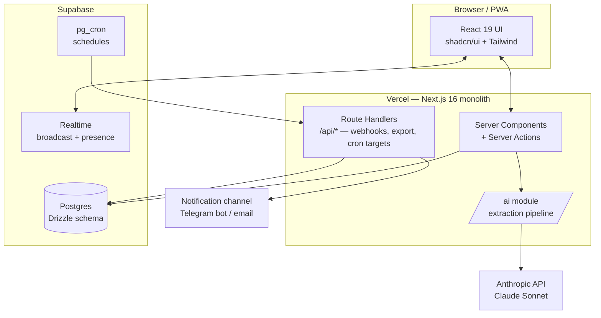

# Engineering Hub — Architecture

Status: v1.0 · 2026-09-21 · Owner: CTO agent · Companion to `Engineering Hub — Product Specification.md`
Decisions and their rationale are logged in `DECISIONS.md`; anything marked **[pending owner]** needs Bitchiko's sign-off before implementation.

## 1. System overview

One Next.js 16 monolith deployed on Vercel, one Postgres database on Supabase, one AI provider (Anthropic). No servers, no microservices, no message broker. Everything below fits the spec's cost ceiling (≤ $10/month).



Data flow for the core loop: meeting form (autosaved to Postgres) → submit → job row + async AI extraction → clarification/proposal state in DB, pushed to the client over Realtime → human confirms → one transaction writes tasks/objectives/decisions → activity log + origin links.

## 2. Stack (final)

| Layer | Choice | Notes / deviation from spec |
| --- | --- | --- |
| Framework | **Next.js 16** (App Router, TS strict) | Spec said 15; 16 is current stable with saner caching defaults. ADR-001 |
| Hosting | Vercel, auto-deploy from `main`, preview per PR | As spec |
| Database | **Supabase Postgres** | Resolves §13 open question. Bundles Realtime + Storage + pg_cron, one vendor instead of three. **[pending owner]** ADR-002 |
| ORM | **Drizzle** | SQL-first, no codegen, small bundle → fast serverless cold starts. ADR-003 |
| Auth | **Better Auth** (GitHub OAuth + email/password, invite-only) | Deviation: spec said Auth.js, which is now in security-patch-only maintenance under the Better Auth team. ADR-004 |
| Realtime | Supabase Realtime (broadcast channels + presence) | Board moves (phase 1, cheap), collaborative forms (phase 5) |
| AI | Anthropic Messages API, `claude-sonnet-5`, temp 0, tool-based JSON output | Server-side only; single `/ai` module |
| UI | Tailwind CSS 4 + shadcn/ui; dnd-kit for drag-and-drop | As spec |
| Validation | Zod v4, schemas in `/lib/schemas` shared by forms, actions, and AI output | As spec |
| Background work | Next.js `after()` for AI jobs; **pg_cron → secured route handler** for schedules | Vercel Hobby cron is too coarse for "15 min before meeting" reminders. ADR-005 |
| Notifications | In-app + **Telegram bot** (email later if needed) | **[pending owner]** ADR-006 |
| PDF export | `@react-pdf/renderer`, server-side | Phase 4 |
| Monitoring | Sentry free tier (client + server) + Vercel logs; AI cost log table in DB | As spec |

## 3. Repository layout

```
/app
  /(auth)            sign-in, invite acceptance
  /(app)             authenticated shell: sidebar + topbar
    /board           kanban, list, my-tasks, calendar views
    /objectives
    /meetings        list, [id] form, [id]/review proposal screen
    /dashboard       role-aware home (member vs viewer variants)
    /decisions
    /archive         global search
    /admin           users, templates, columns, projects, AI settings
  /api               route handlers: cron targets, telegram webhook,
                     export, boss-summary token links, health
/components          shared UI; /components/ui = shadcn primitives
/db
  schema.ts          Drizzle schema (single file until it hurts)
  /migrations        committed SQL migrations
  seed.ts            6 templates, default columns, demo data
/ai
  /prompts/*.md      versioned prompt files (header: version, date, changelog)
  pipeline.ts        submit → extract → clarify → propose orchestration
  client.ts          the ONLY file that imports the Anthropic SDK
  schemas.ts         Zod schemas for extraction output
/lib
  auth.ts            Better Auth config + role guards
  permissions.ts     single source of truth for the 3-role matrix
  queries/           agenda-suggestion + board-context queries (deterministic)
  notifications.ts   channel-agnostic notify(user, event) dispatcher
/messages/en.json    all UI strings (next-intl), Georgian addable later
/tests               vitest: ai-schema, permissions, task-lifecycle
DECISIONS.md · README.md · ARCHITECTURE.md
```

## 4. Application architecture

**Rendering & mutations.** Server Components for all reads; Server Actions for all mutations (board moves, form saves, confirmations). Route Handlers only where an HTTP surface is genuinely needed: cron callbacks, Telegram webhook, token-based boss-summary links, JSON export. Every Server Action and Route Handler starts with `requireRole(...)` from `/lib/permissions.ts` — role enforcement lives server-side in one module, never in the UI (FR-31).

**Optimistic UI.** Board drag-and-drop applies locally via `useOptimistic`, the Server Action persists and writes the activity log, conflicts resolve last-write-wins (FR-3). A Realtime broadcast on channel `board` lets the second user's board update without refresh from phase 1 — it's ~30 lines with Supabase and makes the tool feel alive for a 2-person team.

**Meeting forms & autosave.** Draft answers persist via a debounced (≤5 s) Server Action into `meetings.answers` (JSONB) — DB, never localStorage (FR-15). Phase 5 collaboration: forms are field-structured, so we do **field-granular last-write-wins + presence** over a Realtime broadcast channel per meeting, not a CRDT. Yjs is overkill for two users editing different fields of a form; the only risky surface is the free-text box, and per-field locking ("Nikoloz is typing here") covers it. Revisit only if simultaneous same-field editing actually happens.

**Views & filters.** Filter state lives in URL search params (FR-10) parsed by a shared Zod schema; List/Calendar/My-tasks are alternate renderings over the same query layer in `/lib/queries`.

## 5. Data layer

Schema follows §9 with these implementation decisions:

- `board_columns` is a table (position, name, wip_hint, is_done_column, is_blocked_column) — task status is an FK to it, keeping columns admin-editable. The `is_blocked_column`/`is_done_column` flags are what lifecycle rules key on, so renaming columns never breaks rules.
- `meeting_templates` are versioned as immutable rows: editing a used template inserts a new version row; `meetings.template_version_id` pins the render forever (FR-13).
- `activity_log` is append-only, written inside the same transaction as the mutation it records, with `actor_type: 'user' | 'ai'` + `actor_id` (FR-32). AI writes also stamp `confirmed_by`.
- `ai_calls` table: meeting_id, prompt version, model, tokens in/out, cost, latency, outcome (FR-26).
- `notification_dismissals` covers agenda-suggestion suppression (FR-41): (user, suggestion_hash, dismissed_until).
- Full-text search (FR-11): Postgres `tsvector` generated columns + GIN indexes on tasks, meetings (answers flattened), decisions. No external search service.
- Auto-archive (FR-5) and stale badges (FR-6) are **computed at read time** (`done_at < now()-14d`, `updated_at < now()-7d`), not by a mutation job — nothing to schedule, nothing to drift.
- Migrations: `drizzle-kit generate` output committed; applied in CI before deploy. Seed script is idempotent.

Access pattern: **all DB access goes through Drizzle server-side.** We do not use Supabase's client-side SDK for data (no RLS-based client queries) — permissions live in the app layer where the 3-role matrix is testable. Supabase JS client is used only for Realtime subscriptions (broadcast channels carry no privileged data, just "refetch" signals + presence).

## 6. AI pipeline

The only novel subsystem; everything else is a well-trodden CRUD app.

```
submit (Server Action)
  → meeting.status = 'submitted', insert extraction_jobs row
  → after(): runPipeline(meetingId)        // Vercel keeps fn alive post-response
runPipeline:
  1. build context: meeting record + open tasks/objectives/projects/members
     + template extraction instructions (FR-42)
  2. call Claude Sonnet with a TOOL definition whose input schema mirrors the
     Zod extraction schema → structured output, validated; 1 retry on invalid
  3. confidence < threshold OR duplicate-similarity hit → write clarification
     round (max 5 questions, one batch), meeting.status = 'clarifying'
  4. else meeting.status = 'proposed' → proposal rows written
  → Realtime broadcast: client transitions live; polling fallback every 5 s
confirm (Server Action, human, FR-23):
  one transaction: apply accepted items, origin badges, activity log,
  meeting.status = 'confirmed', record rejected items, freeze meeting record
failure path: any error twice → status 'pending_processing' + retry button;
  the meeting record is already saved before the pipeline ever runs (FR-25)
```

Implementation rules:
- Structured output via **tool use** (forced tool choice), not "please return JSON" — the schema is enforced at the API level and validated again with Zod (belt and braces, FR-19).
- Duplicate detection is two-layer: a deterministic pre-pass (pg_trgm similarity against open task titles) feeds candidate matches *into* the prompt, and the model must resolve each candidate as update-vs-new-vs-ask (FR-22).
- Prompts: one base extraction prompt + per-type instruction block appended (FR-42). Prompt files carry a version header; `ai_calls` logs which version ran, so the phase-2 meeting corpus becomes a regression set for prompt changes.
- Timeouts: Vercel Hobby functions allow up to 300 s with fluid compute — far above the 30 s budget (FR-33). If a call exceeds 60 s we fail fast and mark for retry.

## 7. Scheduling, reminders, notifications

- **Source of truth:** recurrence rules (RRULE strings) on `meeting_templates`; next occurrences materialized into a `scheduled_meetings` table by a nightly job.
- **Trigger:** Supabase **pg_cron** runs every 5 minutes → `net.http_post` to `/api/cron/tick` (secured by bearer secret) → the handler sends due reminders, flags meetings overdue (> 2 h past start, FR-40), and sends the morning digest at 08:30.
- **Dispatch:** `/lib/notifications.ts` exposes `notify(userId, event)`; channels are pluggable. Phase 4 ships in-app (bell + unread) and Telegram bot (grammY, webhook route; each user links their chat once via a deep-link code). Every reminder carries a deep link to the pre-filled form.
- Agenda suggestions (§6.2) are pure SQL in `/lib/queries/suggestions.ts` — deterministic, instant, no AI (FR-41).

## 8. Security

- Invite-only: `invitations` table (email, role, token, expiry); sign-up only completes against a valid token. No public registration path exists.
- Sessions: Better Auth DB-backed sessions, HTTP-only secure cookies, immediate revocation on user deactivation.
- Role checks server-side on every action/route via `/lib/permissions.ts`; the permission matrix has dedicated tests (mandatory per spec).
- Viewer redaction happens in the query layer: viewer-facing queries never select `meetings.answers`/`free_text`, only `summary` (FR-28) — not filtered in the UI.
- Boss-summary links: random 128-bit token rows with revoked_at; the public route renders only the published summary snapshot (FR-35).
- Rate limiting on auth + token routes (Upstash Redis free tier or in-DB counter — decide at phase 0 implementation).
- `ANTHROPIC_API_KEY`, `DATABASE_URL`, `AUTH_SECRET`, `CRON_SECRET`, `TELEGRAM_BOT_TOKEN` in Vercel env only. Server-only modules marked `import 'server-only'`.
- Backups: Supabase daily backups + weekly `pg_dump` GitHub Action artifact to a private repo (FR-36); one-click JSON export route (admin only).

## 9. Quality, CI/CD, observability

- **Tests (Vitest):** mandatory suites — AI extraction schema (valid/invalid/mixed Georgian-English fixtures), permission matrix per route/action, task lifecycle rules (blocked-reason, archive, stale). Playwright smoke test on the core loop from phase 3. UI snapshots optional per spec.
- **CI (GitHub Actions):** typecheck + lint (Biome) + tests + drizzle migration check on every PR; merge to `main` → migrate → Vercel production deploy. Preview deployments get a branch database via Supabase branching.
- **Observability:** Sentry (client + server, release-tagged); `ai_calls` table doubles as a cost dashboard on the admin screen; Vercel logs for the rest.
- **Definition of done per phase** is Appendix A of the spec; each phase closes with a demo on a phone browser.

## 10. Phase mapping (what this architecture defers)

| Phase | Architecture surface activated |
| --- | --- |
| 0 | Repo, CI, Supabase project, Drizzle + migrations, Better Auth + invites, Sentry, skeleton shell |
| 1 | Board module, activity log, Realtime board channel, optimistic DnD, list/my-tasks views |
| 2 | Objectives, template engine + seed templates, meeting forms + autosave, agenda suggestions (core set), search |
| 3 | `/ai` module, extraction jobs, clarification + proposal screens, origin badges, prompt versioning |
| 4 | Dashboards, viewer role surfaces, pg_cron reminders + Telegram, weekly summary + PDF + token links, decision log, JSON export |
| 5 | Realtime form co-editing, PWA manifest + install, quarterly layer, template editor UI, Georgian locale |
