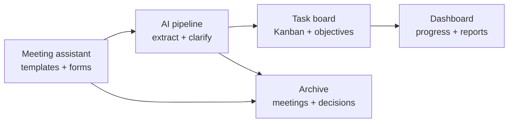
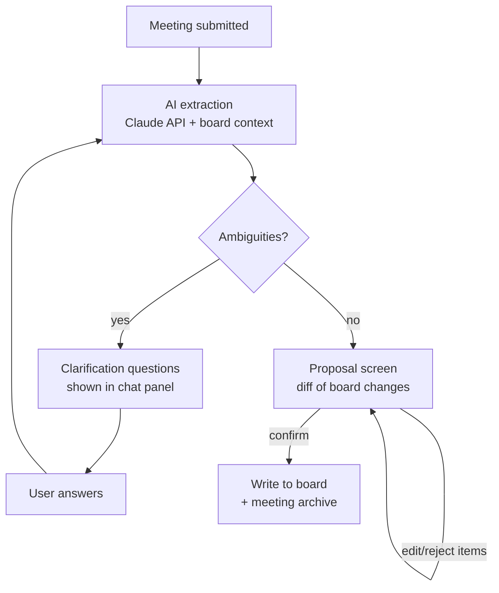
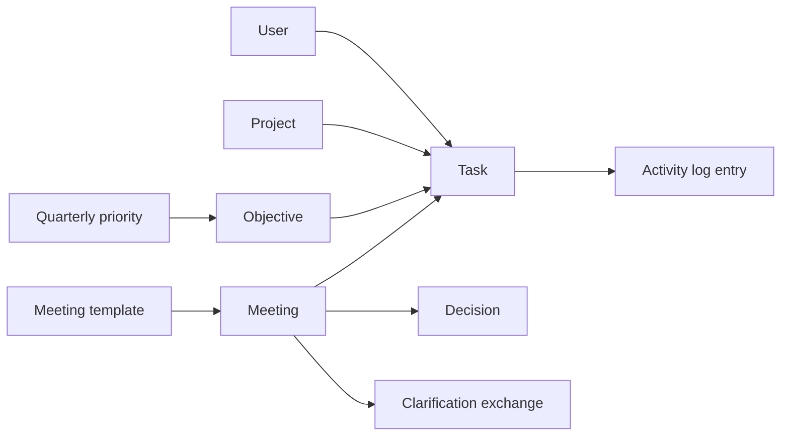

# Engineering Hub — Product Specification

2026-09-21 · @Someone

## 0. Brief for the implementing agent

You are the implementing agent (acting CTO) for Engineering Hub. This document is your product specification. Build it phase by phase per §12; each phase must be deployed to Vercel and usable on desktop + mobile browser before the next begins.

**How to read this document**

| Sections | Status for you |
| --- | --- |
| §1 Overview, §4 Module map | Binding intent — resolve any ambiguity in favor of these principles |
| §2 Market research | Context only — you may skip it; nothing in it is a requirement |
| §3, §5–§9 | Binding functional spec |
| §10–§11 | Binding technical constraints; library-level substitutions allowed if justified in DECISIONS.md |
| §12 Roadmap | Binding build order |
| §13 Metrics & open questions | Metrics inform design; open questions — see decision authority below |
| Appendix A | The testable requirements checklist — your definition of done per phase |

**Decision authority**

- You decide freely: UI layout details, file/folder structure, naming, component library usage, anything unspecified.
- You ask the product owner (Bitchiko) before implementing: every open question in §13, and any deviation from Appendix A requirements.
- You never change without explicit approval: human confirmation before AI board writes (FR-23), the three-role permission model (§3), full JSON data export (FR-36), invite-only auth.

**Working conventions**

- TypeScript strict mode; Zod schemas shared between forms, API routes and AI output validation.
- All DB schema changes as committed migrations; include a seed script with the 6 meeting templates, default columns, and demo data.
- Maintain `DECISIONS.md` (technical choices + reasons) and `README.md` (setup, env vars, deploy steps) from day one.
- Tests are mandatory for: AI JSON schema validation, permission checks on API routes, task lifecycle rules (FR-4–FR-6). UI snapshot tests optional.
- Prompts live in `/ai/prompts/*.md` with version headers; never inline in code.
- Small, phase-scoped pull requests; every merge to main auto-deploys.

**Definition of done (every phase)**: deployed on Vercel; the phase's Appendix A requirements demonstrably pass; works on a phone browser; no unhandled errors in Sentry; README updated.

## 1. Overview & vision

Engineering Hub is a self-hosted web application for the Transporter Group engineering department that combines a task board, weekly objectives, and an AI-powered meeting assistant in one tool. The core loop: run a meeting with a guided template → fill in answers during the meeting → submit → AI extracts tasks, objectives, decisions and blockers, asks clarifying questions if needed, and places tasks on the board automatically.

**Problem it solves.** Meetings produce decisions and tasks that die in notebooks. Off-the-shelf tools either track tasks (Trello, Linear) or capture meetings (Fellow, Otter) but not both, and the two-person department needs zero-overhead process, not enterprise workflow. Nothing on the market covers the full loop — structured meeting templates → AI extraction → board placement — in one lightweight tool the team fully controls.

**Vision statement.** Every meeting ends with its outcomes on the board within two minutes of submission, and the state of all department work is visible on one screen at any moment — to the team and, in read-only form, to management.

**Guiding principles**

- Zero-ceremony: filling a meeting form must be faster than taking freehand notes.
- One source of truth: if it is not on the board, it does not exist.
- AI proposes, humans confirm: the AI never silently creates or moves tasks; every distribution is reviewed before it lands.
- Built to expand: everything works for 2 users but nothing breaks at 10.

**Deployment model.** GitHub repository → Vercel deployment (Next.js), managed Postgres, Anthropic API for the AI layer. No servers to maintain.

## 2. Market research: what exists and why build custom

*Context only — the implementing agent may skip this section; it contains no requirements.*

Existing tools each cover part of the loop; none covers all of it in a form suitable for a two-person team.

| Tool | Category | What it does well | Gap for our use case |
| --- | --- | --- | --- |
| [Trello / GitHub Projects](https://github.com/features/issues) | Task board | Simple Kanban, free | No meeting layer, no AI extraction |
| [Linear](https://linear.app) | Issue tracking | Fast UX, cycles/objectives | Built for software issues; meetings are external; per-seat cost |
| [Fellow](https://fellow.ai/use-cases/meeting-notes-app) | AI meeting assistant | Agendas, transcription, AI recaps; pushes action items to Asana/Jira/Linear/ClickUp | Assumes recorded calls, not in-person structured forms; tasks live in a second tool; per-seat cost |
| [ClickUp](https://clickup.com/compare/vs/fellow) | All-in-one PM | Native tasks + AI notetaker + automations in one platform | Heavy: hundreds of features, real onboarding cost for 2 people; generic templates, not our 6 meeting types |
| Notion / Coda | Docs + databases | Flexible meeting docs linked to task databases | Everything is manual assembly; no clarification-loop AI; easy to let structure rot |
| Otter / Fireflies / Fathom | Transcription | Accurate transcripts and summaries | Transcription only — no board, no task lifecycle |

**Lessons to steal from the market**

- From Fellow: collaborative agenda filled *during* the meeting, and one-click conversion of action items into tracked tasks — the sync between meeting record and task is the killer feature.
- From Linear: speed and keyboard-friendliness; the tool must open in under 2 seconds or the daily sync will abandon it.
- From ClickUp: action items must link back to the meeting they came from (traceability both ways).
- From all of them: AI summaries are only trusted when the human confirms before anything is written — hence our mandatory review step.

**Why custom wins here.** The department's meeting structure is fixed and known (6 types), the team is 2 people (per-seat SaaS pricing buys nothing), the AI cost is pennies per meeting via direct API, and the tool doubles as an internal showcase of the department's AI capability — relevant when pitching AI work to Transporter Group management. Estimated running cost: Vercel free/hobby tier + managed Postgres free tier + \~$2–5/month Anthropic API usage.

## 3. Users, roles and permissions

Three roles, designed so the model still works when the department grows.

| Role | Who (today) | Can do |
| --- | --- | --- |
| Admin | Head of Engineering | Everything: manage users, meeting templates, board structure, AI settings, delete anything |
| Member | Engineer(s) | Create/edit/move tasks, participate in meetings, submit meeting forms, comment |
| Viewer | Boss / management | Read-only: dashboard, board, objectives, meeting summaries. No task editing, no raw meeting free-text (sees the AI summary only) |

**Authentication.** Email + password or GitHub OAuth (the team already lives in GitHub). Invitation-only — no public sign-up. Sessions via secure HTTP-only cookies. Two-factor optional in later phase.

**Access notes**

- The Viewer role is deliberate: the weekly boss sync (meeting #5) works far better when the boss arrives already having seen the dashboard.
- Every action is attributed — tasks show who created them (human or "AI, confirmed by X") and who moved them last.
- All roles work from mobile browser; the daily sync will often be filled from a phone in the workshop.

## 4. Core modules

Five modules share one database; the meeting assistant feeds the board through the AI pipeline.

Reading: a meeting is run inside the meeting assistant; on submit, the AI pipeline turns its content into tasks and objectives on the board; the dashboard reads board state for progress views; every meeting and every decision lands in the searchable archive.

| Module | One-line purpose | Spec |
| --- | --- | --- |
| Task board & objectives | Kanban of all department work, grouped under weekly objectives | §5 |
| Meeting assistant | Guided forms for the 6 meeting types, filled live during the meeting | §6 |
| AI pipeline | Turns submitted meetings into tasks, with a clarification loop and human confirmation | §7 |
| Dashboard & archive | Progress overview, boss-ready reports, decision log, meeting history | §8 |
| Administration | Users, template editing, board configuration, AI prompt settings | covered in §3 and §10 |

## 5. Module: Task board & objectives

A Kanban board is the single source of truth for all department work; objectives group tasks into weekly commitments.

**Board structure**

- Default columns: Backlog → This week → In progress → Blocked → Review → Done. Admin can rename/add/remove columns.
- Swimlanes (optional toggle): by project (FaceGate, tender monitoring, parking systems, diagnostics…) or by assignee.
- Work-in-progress hint: soft warning when one person has more than 3 tasks In progress — a nudge, never a block.

**Task card — fields**

| Field | Type | Required | Notes |
| --- | --- | --- | --- |
| Title | text | yes | Imperative, e.g. "Finish CAN reader for Kässbohrer unit" |
| Type | select | yes | From admin-managed task-type list (see below); defaults to "Internal" |
| Requester | text + department | only for external types | Who asked and from where, e.g. "G. Beridze — Service" |
| Description | rich text | no | Markdown; checklists for subtasks |
| Assignee | user | yes | Single owner — no shared tasks |
| Project | select | no | From admin-managed project list |
| Objective | link | no | Ties task to a weekly objective |
| Priority | select | yes | P1 urgent / P2 normal / P3 someday |
| Due date | date | no | Overdue cards get a red badge |
| Estimate | select | no | S (<2h) / M (half-day) / L (1–3 days) / XL (needs splitting) |
| Blocked reason | text | only in Blocked | Forces naming the blocker |
| Origin | auto | — | "Manual" or link to the source meeting |
| Labels | multi-select | no | e.g. hardware, firmware, app, CAD, AI, admin |

**Task types**

Tasks carry a type from an admin-managed list — users name and manage the groups themselves. Seed defaults: Internal, Service request, Print job, Repair, Admin. Each type has a name, color, icon, and an "external" flag; external types require the requester fields, so every favor done for another department is documented and countable. External requests are logged by the team (no outside access in v1). Types are a first-class analytics dimension: "how much of our week goes to service requests" must be answerable in one click.

**Task lifecycle rules**

- Moving to Blocked requires the blocked-reason field — this feeds the daily sync automatically.
- Moving to Done timestamps completion; Done column auto-archives cards older than 14 days (still searchable).
- Any card untouched for 7 days gets a "stale" badge; stale cards are auto-listed in the weekly planning form (§6).
- Full activity log per card: created, edited, moved, commented — by whom, when.
- Comments on cards with @mention notifications.

**Objectives**

- An objective = a named outcome with a week (or date range), an owner, and linked tasks, e.g. "Diagnostic app covers CFMoto models — week of Oct 5".
- Objective states: Planned → Active → Achieved / Missed / Rolled over. Progress auto-computed from linked tasks (3/5 done).
- Weekly view pins active objectives above the board — always visible.
- Quarterly objectives (from the boss meetings) sit one level above weekly ones; weekly objectives can be linked to a quarterly parent, giving the boss dashboard a live "quarter progress" view.

**Views**

- Board (default), List (sortable table — useful for review meetings), My tasks (per person), Calendar (due dates).
- Global search across tasks, meetings, decisions.
- Filters: assignee, project, label, priority, overdue-only; filter state stored in the URL so views can be bookmarked.

## 6. Module: Meeting assistant

The user picks a meeting type; the app opens a structured form matching that meeting's outline; the team fills it in live during the meeting; a free-text box catches everything the structure doesn't; Submit hands the whole record to the AI pipeline (§7).

**Flow**

1. New meeting → choose type (six built-in templates below; admin can edit templates or add new ones).
2. The form pre-loads context: relevant board state (e.g. weekly planning shows unfinished tasks from last week automatically; daily sync shows each person's In-progress and Blocked cards).
3. Fields are filled during the meeting — collaborative editing, both users can type simultaneously; autosave every few seconds; a meeting can be paused and resumed.
4. Every template ends with **Additional notes** — a free-text box for anything outside the structure. The AI reads this box with the same weight as the structured answers.
5. Submit → AI pipeline. A meeting can also be saved as draft without submitting.

### 6.1 Meeting type definitions

A meeting type is a first-class object, not just a form: it stores cadence, duration, participants, question sections, auto-loaded board context, and its own AI extraction instructions. The system uses the type to schedule reminders, suggest agenda items, shape the form, and steer extraction. Six defaults ship as seed data:

| Type | Cadence (default) | Duration | Participants | Primary outputs |
| --- | --- | --- | --- | --- |
| Daily sync | Every workday 09:30 | 10 min | Whole team | Task status updates, unblock actions |
| Weekly planning | Monday 10:00 | 30 min | Whole team | Weekly objectives + tasks |
| Weekly review | Friday 16:30 | 15–20 min | Whole team | Objective outcomes, follow-ups, boss-agenda items |
| Monthly retrospective | Last Friday 15:00 | 45 min | Whole team | Process-change decisions |
| Boss sync | Weekly (day set by admin) | 30 min | Head + boss | Decision requests, priority alignment |
| Quarterly planning | Every 3 months | 60–90 min | Head + boss (team optional) | Quarterly priorities, resource decisions |

**Daily sync** — Questions per person: What did I complete yesterday? · What am I doing today? · Anything blocking me? Auto-context: yesterday's board moves; each person's In-progress and Blocked cards (answers become confirm-and-adjust). AI extraction focus: status moves (tasks\_update), small new tasks, blockers → Blocked with reason; flag any task whose answers are unchanged three days running.

**Weekly planning** — Sections: carry-over review (each unfinished task: keep / drop / re-scope) · this week's 2–4 objectives phrased as outcomes · task breakdown per objective with owner · capacity check (travel, showroom support, holidays) · head's hands-on vs. coordination split. Auto-context: unfinished + stale tasks from last week; last week's objectives and their end states. AI focus: create objectives and their linked tasks; close or roll over last week's items.

**Weekly review** — Sections: per objective — hit or missed, and why · shipped items needing follow-up (docs, informing sales, field testing) · wins worth noting · items to raise with the boss. Auto-context: this week's objectives with live progress; tasks completed this week. AI focus: objective state changes, follow-up tasks, and boss-agenda items tagged for the next boss sync.

**Monthly retrospective** — Sections: what worked well · what slowed us down · what we change next month (max 2) · did we do last retro's changes? · tooling/skills gaps · is the meeting structure itself still working? Auto-context: last retro's committed changes; month statistics (tasks completed, days spent blocked). AI focus: decisions (process changes) and improvement tasks.

**Boss sync** — Sections: delivered since last sync, in business terms · current priorities · decisions needed, each with a deadline · risks and blockers · incoming direct requests from other departments · questions for the boss (what's coming in 1–3 months; current top priority; feedback from other departments). Auto-context: items tagged "raise with boss"; open decision requests; quarter progress. AI focus: decision-log entries, decision-request items with due dates, priority changes; generates the shareable boss summary.

**Quarterly planning** — Sections: quarter in review — delivered + impact · next quarter's 3–5 priorities, force-ranked · resource asks (hiring, equipment, training) · longer-term bets needing runway. Auto-context: quarter statistics; current quarterly priorities and status. AI focus: quarterly priority records and their initial high-level tasks.

### 6.2 Scheduling, reminders & agenda suggestions

The cadence stored on each meeting type drives three automatic behaviors:

**Scheduling.** Each type carries a recurrence rule (weekday + time, editable per type) and reminder offsets. The dashboard shows the next occurrence of every type; a scheduled meeting not started within 2 hours shows as "overdue" on the dashboard.

**Reminders.** Sent per type schedule via the configured notification channel (email / Telegram bot / in-app — channel choice is open question in §13). Defaults: 15 minutes before each meeting, plus a morning digest listing today's meetings and overdue tasks. Reminders include a deep link that opens the pre-filled meeting form.

**Agenda suggestions.** When a meeting form opens, the system compiles suggested discussion items from board state using per-type rules — deterministic queries, not AI, so it is instant and free:

| Suggestion source | Fed into |
| --- | --- |
| Blocked tasks (with reasons) | Daily sync, weekly planning |
| Stale tasks (7+ days untouched) | Weekly planning |
| Overdue tasks | Daily sync, weekly planning, weekly review |
| Tasks whose daily-sync answers repeat 3 days | Daily sync (flagged), retro |
| Items tagged "raise with boss" | Boss sync |
| Open decision requests past their deadline | Boss sync |
| Last retro's committed changes | Monthly retrospective |
| Objectives at risk (< 50 % done by Thursday) | Weekly review |

Each suggestion is a card the user inserts into the form with one click or dismisses; dismissals are logged so the same item is not re-suggested within the same week.

**Per-type agent instructions.** Every meeting type stores an "extraction instructions" text block that is appended to the AI prompt for that type (e.g. the daily sync's instructions say "prefer tasks\_update over tasks\_new; only create a new task if no open card matches"). Admin-editable in the template editor, versioned with the template — this is how the team tunes AI behavior per meeting type without touching code.

**Template engine.** Templates are data, not code: an admin screen defines sections, question types (short text, long text, per-person repeat, checklist, auto-loaded board query), and ordering. This is what makes the six templates editable and new ones addable without redeployment.

**Meeting record.** Each completed meeting stores: type, date, participants, all answers, the free-text box, the AI's extraction, the clarification exchange, and links to every task/objective it produced. Records are immutable after confirmation — corrections happen on the board, keeping the meeting an honest historical record.

## 7. Module: AI processing pipeline

On submit, the AI reads the full meeting record, proposes structured changes to the board, asks clarifying questions when confidence is low, and applies changes only after human confirmation.

**Step 1 — Extraction.** The API call includes: the meeting record (structured answers + free-text box), the current board state (open tasks, objectives, projects, members), and the template's extraction rules. The model returns strict JSON with four lists:

- `tasks_new` — title, description, assignee, project, objective link, priority, estimate, due date, source quote (which sentence in the meeting produced it)
- `tasks_update` — existing task ID + changes (status move, reassignment, new due date, e.g. "the blocked ESP32 task is now unblocked")
- `objectives` — new or status-changed objectives (weekly planning and review meetings mainly)
- `decisions` — statements for the decision log, with context ("chose MQTTS over HTTP polling because…")

**Step 2 — Clarification loop.** Each extracted item carries a confidence level. Low confidence triggers questions before the proposal is shown, e.g.:

- "You wrote 'Nikoloz will look at the parking sensor issue' — is this a new task or the existing card 'Debug Rustavi gate sensor'?"
- "'Finish the app by end of month' — which app: the diagnostics app or FaceGate Android?"
- "No owner was named for 'order spare ESP32 boards' — who takes it?"

Max 5 questions per round, asked in one batch (not a drip); the user can answer or skip each; skipped items land in the proposal marked "needs attention". Duplicate detection is always on: anything resembling an existing open card becomes a question, never a silent duplicate.

**Step 3 — Proposal screen.** A diff view: left, the meeting source; right, proposed cards/updates, each editable inline, each with accept / edit / reject. "Confirm all" applies everything accepted in one transaction. Nothing touches the board before this click.

**Step 4 — Write + trace.** Applied items are created/updated with origin = this meeting; the meeting record stores what was applied and what was rejected. Every AI-created card shows a small badge linking back to its source meeting and quote.

**Model & cost.** Claude Sonnet via the Anthropic Messages API, temperature 0, JSON-only output with schema validation and one automatic retry on invalid JSON. A typical meeting is 2–4 K tokens in, \~1 K out — well under $0.05 per meeting. All prompts live in versioned files in the repo so extraction behavior is code-reviewed like everything else.

**Failure handling.** API down or JSON invalid twice → the meeting is saved intact with status "pending processing" and a retry button; no data is ever lost to an AI failure. The pipeline is asynchronous — submit returns immediately and processing state is shown live.

## 8. Module: Dashboard, reporting & archive

The dashboard answers "how are we doing?" in one screen; the archive answers "what happened and why?" via search.

**Dashboard (home screen)**

- This week's objectives with live progress bars (tasks done / total).
- Board snapshot: counts per column, with Blocked highlighted first.
- Overdue and stale tasks list.
- Upcoming: due dates in the next 7 days, next scheduled meeting.
- Decisions-pending list: items from boss syncs marked "decision needed" that are still open.
- Quarter progress: quarterly priorities with % of linked weekly objectives achieved.

**Boss view.** The Viewer role lands on a simplified dashboard: quarter progress, this week's objectives, delivered-recently feed, and open decision requests addressed to them. This makes meeting #5 a discussion, not a status readout.

**Reports (generated, not hand-written)**

- Weekly summary: auto-drafted from the week's meetings + board activity, editable before sharing; export as PDF or shareable link.
- Monthly/quarterly rollups: objectives hit rate, completed tasks by project, where time actually went vs. planned — the evidence base for the hiring case.

**Analytics dashboard.** A separate analytics screen (admin + members; key charts also feed the boss view) answering "where does our time actually go" over selectable ranges (week / month / quarter): throughput (tasks completed per week), completed tasks by project, by task type, and by assignee; external-request volume by requesting department; time-in-column analysis (especially days spent Blocked); objectives hit rate; overdue/stale trends; AI pipeline stats (acceptance rate, cost). All computed from board data + activity log with plain SQL — no third-party analytics service. This is the evidence base for the hiring case and for showing management what external departments consume.

**Decision log.** Every AI-extracted decision (and manually added ones) in one chronological, searchable list: date, decision, context, source meeting link. This is the department's institutional memory — the answer to "why did we choose MQTTS?" six months later, and the onboarding document for hire #3.

**Archive.** Full-text search across all meetings, tasks (including auto-archived Done cards) and decisions; filter by type, date range, project, person.

## 9. Data model

Nine core entities; arrows read "has many".

| Entity | Key fields |
| --- | --- |
| User | id, name, email, role, auth provider, active |
| Project | id, name, color, active |
| Task | id, title, description, status, assignee\_id, project\_id, objective\_id, priority, estimate, due\_date, blocked\_reason, origin\_meeting\_id, labels\[\], created\_by (user or ai), timestamps |
| Objective | id, title, week\_start, owner\_id, state, quarterly\_priority\_id |
| Quarterly priority | id, title, quarter, rank, notes |
| Meeting template | id, name, cadence (recurrence rule), duration, participants, reminder offsets, sections (JSON: questions, types, board-query rules), agenda-suggestion rules, extraction instructions, active version |
| Meeting | id, template\_id + version, date, participants\[\], answers (JSON), free\_text, status (draft / submitted / processed / confirmed), summary |
| Clarification exchange | id, meeting\_id, questions/answers (JSON), round |
| Decision | id, text, context, meeting\_id, date |
| Activity log entry | id, entity type + id, action, actor, diff, timestamp |

Notes: task status is a foreign key to an admin-editable columns table, not an enum, so board columns stay configurable; meeting answers stay as JSON because templates evolve — the template version stored with each meeting keeps old records renderable.

## 10. Tech stack & architecture

Everything managed, nothing to operate: GitHub → Vercel, one Postgres, one AI API.

| Layer | Choice | Why |
| --- | --- | --- |
| Framework | Next.js 15 (App Router, TypeScript) | One repo for UI + API routes; first-class on Vercel |
| Hosting | Vercel, auto-deploy from GitHub main | Zero ops; preview deployments per PR |
| Database | Neon Postgres (or Supabase) | Managed, free tier fits; Supabase adds auth + realtime if chosen |
| ORM | Drizzle (or Prisma) | Typed schema, migrations in repo |
| Auth | Auth.js — GitHub OAuth + credentials, invite-only | Team already on GitHub |
| Realtime | Pusher/Ably channel or Supabase Realtime | Live board moves + collaborative meeting forms |
| AI | Anthropic Messages API, key in Vercel env vars | Server-side only — the key never reaches the browser |
| UI | Tailwind + shadcn/ui; dnd-kit for drag-and-drop | Fast to build, decent defaults |
| Validation | Zod schemas shared between form, API and AI JSON output | One schema validates the AI's response |
| Background work | Vercel function for AI processing; status polled/pushed to client | Keeps submit instant |
| PDF export | React-pdf or headless rendering for boss summaries | Weekly report as file |
| Monitoring | Sentry free tier + Vercel logs | Know when the pipeline fails |

**Architecture notes**

- Monolith by design — no microservices at this scale; API routes + server components in one Next.js app.
- All AI calls go through one internal `ai/` module: prompt templates, schema validation, retry, cost logging per call. Nothing else in the codebase talks to the Anthropic API directly.
- Meeting form autosave writes drafts to the DB, not localStorage — a dropped phone connection in the workshop must not lose a meeting.
- Repo layout: `/app` (routes), `/components`, `/db` (schema + migrations), `/ai` (prompts + pipeline), `/lib`. Prompts are `.md` files with version headers.
- Environment: `DATABASE_URL`, `ANTHROPIC_API_KEY`, `AUTH_SECRET`, OAuth credentials — all in Vercel project settings, never committed.

## 11. Non-functional requirements

- **Performance:** board loads in under 2 s on office Wi-Fi and 4G; drag-and-drop feels instant (optimistic UI, server sync in background); AI processing under 30 s with visible progress.
- **Mobile:** fully usable board and daily-sync form on a phone browser; installable as a PWA icon. Native app explicitly out of scope.
- **Availability:** business hours matter, 99.9 % does not — Vercel + Neon defaults are enough. If the app is down, meetings happen on paper and get entered later; nothing about the process hard-depends on the tool.
- **Security:** HTTPS everywhere (Vercel default); invite-only auth; role checks on every API route, not just the UI; Anthropic key server-side only; rate limiting on auth endpoints. Meeting content includes internal business information — no public sharing links except the explicit boss-summary link, which is token-based and revocable.
- **Backups:** Neon point-in-time recovery + a weekly automated dump to a private repo or object storage; one-click JSON export of everything (tasks, meetings, decisions) so data is never trapped in the tool.
- **Localization:** UI in English at launch; all strings in one messages file so Georgian can be added later. AI must handle mixed Georgian/English meeting notes correctly — include this in extraction prompt test cases.
- **Auditability:** every write is in the activity log; AI-originated changes always distinguishable from human ones.
- **Cost ceiling:** total running cost under $10/month at current team size (Vercel hobby, Neon free tier, API usage).

## 12. Roadmap

Ship the board first and start using it the same week; the AI layer arrives once real meeting data exists to test it on.

| Phase | Scope | Target |
| --- | --- | --- |
| 0 — Setup | Repo, Vercel project, DB, auth, user invites | Weekend |
| 1 — Board MVP | Kanban with full task cards, projects, drag-and-drop, list view, activity log. **Start daily use here.** | \~1–2 weeks of side-time |
| 2 — Objectives + meetings (manual) | Objectives layer; meeting forms for all 6 templates; records saved and browsable — tasks still created by hand from the form | +1–2 weeks |
| 3 — AI pipeline | Extraction, clarification loop, proposal screen, board writes, origin badges | +2 weeks |
| 4 — Dashboard + boss view | Dashboards, Viewer role, weekly summary export, decision log | +1–2 weeks |
| 5 — Polish | Realtime collaboration in forms, PWA, quarterly layer, Georgian strings, template editor UI | ongoing |

Sequencing rationale: phases 1–2 deliver value with zero AI risk, and the meetings recorded during phase 2 become the test set for tuning the phase-3 extraction prompts against reality instead of guesses.

**Explicitly out of scope (v1):** time tracking, Gantt charts, client/external access, chat, file storage beyond task attachments, calendar integration, meeting audio transcription (structured forms replace it — revisit only if the form workflow fails).

## 13. Success metrics & open questions

The tool succeeds if the process sticks; measure usage, not features.

- Meeting compliance: ≥ 90 % of scheduled meetings recorded in the tool over a month.
- Post-meeting latency: outcomes on the board within 2 minutes of submit (median).
- AI acceptance rate: ≥ 80 % of proposed items confirmed without edits by month two — the tuning target for extraction prompts.
- Board freshness: fewer than 3 stale cards at any weekly planning.
- The real test: after 3 months, would you and Nikoloz refuse to go back to working without it?

**Open questions**

- [ ] Neon + Auth.js vs. Supabase (auth + realtime bundled) — decide at phase 0.
- [ ] Should the boss get a login (Viewer) from day one, or only shared summaries until phase 4?
- [ ] Notification channel for @mentions and overdue tasks: email, Telegram bot, or in-app only?
- [ ] Does the daily sync stay a meeting form, or become an async check-in each person fills before 10:00?
- [ ] Product name — "Engineering Hub" is a placeholder.

## Appendix A — Numbered functional requirements

Each requirement is a testable statement; the phase column maps to §12. "Shall" = mandatory.

**Task board & objectives**

| ID | Requirement | Phase |
| --- | --- | --- |
| FR-1 | Kanban board with admin-configurable columns; defaults: Backlog, This week, In progress, Blocked, Review, Done | 1 |
| FR-2 | Task cards shall carry all fields of the §5 field table; title, assignee, priority required at creation | 1 |
| FR-3 | Drag-and-drop between columns with optimistic UI; server sync in background; conflict resolved last-write-wins with activity-log entry | 1 |
| FR-4 | Moving a task to Blocked shall require a non-empty blocked\_reason | 1 |
| FR-5 | Done cards auto-archive after 14 days; archived cards remain in search and list views | 1 |
| FR-6 | Tasks with no activity for 7 days show a stale badge; the stale list is injected into the next weekly-planning form | 2 |
| FR-7 | Every card has an activity log (created/edited/moved/commented, actor, timestamp) and threaded comments with @mentions | 1 |
| FR-8 | Objectives have states Planned/Active/Achieved/Missed/Rolled over; progress auto-computed from linked tasks; active objectives pinned above the board | 2 |
| FR-9 | Quarterly priorities exist one level above weekly objectives; quarter progress = share of linked weekly objectives achieved | 5 |
| FR-10 | Views: Board, List (sortable table), My tasks, Calendar; filters (assignee, project, label, priority, overdue) persisted in URL | 1–2 |
| FR-11 | Global full-text search across tasks, meetings, decisions | 2 |

**Meeting assistant**

| ID | Requirement | Phase |
| --- | --- | --- |
| FR-12 | The 6 templates of §6 ship as seed data, sections and questions exactly as specified | 2 |
| FR-13 | Templates are data: sections, question types (short text, long text, per-person repeat, checklist, board query) editable by admin; template versions immutable once used | 2 (editor UI: 5) |
| FR-14 | Meeting forms pre-load board context defined by the template (e.g. daily sync shows each participant's In-progress and Blocked cards; weekly planning lists unfinished + stale tasks) | 2 |
| FR-15 | Forms support simultaneous editing by all participants; autosave to the database at ≤5 s intervals; drafts survive connection loss | 2 (realtime: 5) |
| FR-16 | Every template ends with a free-text "Additional notes" field; the AI shall process it with equal weight to structured answers | 2 |
| FR-17 | Meetings can be saved as draft, paused, resumed; Submit is explicit and triggers the pipeline | 2 |
| FR-18 | Confirmed meeting records are immutable and store: answers, free text, extraction output, clarification exchanges, links to all produced/updated items | 3 |

**Meeting types, scheduling & reminders**

| ID | Requirement | Phase |
| --- | --- | --- |
| FR-39 | Meeting types are first-class records storing cadence, duration, participants, reminder offsets, sections, auto-context queries, agenda-suggestion rules and extraction instructions; the 6 defaults of §6.1 ship as seed data | 2 |
| FR-40 | Reminders are sent per type schedule via the configured channel, with a deep link to the pre-filled form; the dashboard shows next occurrences and marks a meeting overdue if not started within 2 h | 4 |
| FR-41 | Opening a meeting form compiles rule-based agenda suggestions per the §6.2 table; each is insertable with one click or dismissible; dismissals suppress re-suggestion for 7 days | 2 (full set: 4) |
| FR-42 | Each type's extraction-instructions block is appended to the AI prompt for that type; admin-editable and versioned with the template | 3 |

**AI pipeline**

| ID | Requirement | Phase |
| --- | --- | --- |
| FR-19 | Extraction calls the Anthropic Messages API with meeting record + current board state + template rules; output is strict JSON with tasks\_new, tasks\_update, objectives, decisions per §7; validated by the shared Zod schema; one automatic retry on invalid output | 3 |
| FR-20 | Every tasks\_new item carries a source quote from the meeting text | 3 |
| FR-21 | Items below the confidence threshold generate clarification questions: max 5 per round, presented as one batch, each answerable or skippable; skipped items marked "needs attention" in the proposal | 3 |
| FR-22 | Duplicate detection against open tasks is always on; a resembling item becomes a clarification question, never a silent duplicate | 3 |
| FR-23 | No board write occurs before the user confirms on the proposal screen; each proposed item is individually acceptable/editable/rejectable; confirmed items apply in one transaction | 3 |
| FR-24 | AI-created/updated cards display an origin badge linking to the source meeting and quote | 3 |
| FR-25 | Processing is asynchronous: submit returns immediately, status is visible live; API failure or twice-invalid JSON leaves the meeting saved as "pending processing" with a retry button — zero data loss | 3 |
| FR-26 | Prompts are versioned files in `/ai/prompts/`; every API call logs tokens and cost | 3 |

**Dashboard, reporting, roles**

| ID | Requirement | Phase |
| --- | --- | --- |
| FR-27 | Dashboard shows: active objectives with progress, per-column counts (Blocked first), overdue + stale lists, next-7-days due dates, open decision requests, quarter progress | 4 |
| FR-28 | Viewer role gets a simplified dashboard and read-only board/summaries; Viewers never see raw meeting free-text, only AI summaries | 4 |
| FR-29 | Weekly summary auto-drafts from the week's meetings + board activity; editable before sharing; exportable as PDF and as a revocable token link | 4 |
| FR-30 | Decision log: chronological, searchable, each entry linked to its source meeting | 4 |
| FR-31 | Auth is invite-only (GitHub OAuth + credentials); the three roles of §3 are enforced server-side on every API route | 0–1 |
| FR-32 | Every write lands in the activity log; AI-originated changes are always distinguishable from human ones | 1–3 |

**Non-functional**

| ID | Requirement | Phase |
| --- | --- | --- |
| FR-33 | Board initial load < 2 s on 4G; AI processing < 30 s with visible progress | 1, 3 |
| FR-34 | All screens usable on phone browser; app installable as PWA | 1 (PWA: 5) |
| FR-35 | Anthropic API key server-side only; rate limiting on auth endpoints; boss-summary links are token-based and revocable | 0–4 |
| FR-36 | One-click JSON export of all tasks, meetings, decisions; weekly automated DB backup | 4 |
| FR-37 | All UI strings in one messages file (English at launch, Georgian addable); extraction test cases include mixed Georgian/English notes | 2–3 |
| FR-38 | Total running cost ≤ $10/month at 2–3 users | all |

**Task types & analytics**

| ID | Requirement | Phase |
| --- | --- | --- |
| FR-43 | Tasks carry a type from an admin-managed task-type list (name, color, icon, external flag); seed defaults: Internal, Service request, Print job, Repair, Admin; type is required, defaulting to Internal | 1 |
| FR-44 | Types flagged "external" require requester name + department at creation; external tasks are team-logged (no outside access in v1) and countable by requesting department | 1 |
| FR-45 | Analytics dashboard with range selector (week/month/quarter): throughput, completions by project/type/assignee, external-request volume by department, time-in-column incl. days Blocked, objectives hit rate, overdue/stale trends, AI acceptance rate + cost; computed via SQL from board + activity log | 4 (deep cuts: 5) |

### Sources

- [Fellow — meeting notes app and integrations](https://fellow.ai/use-cases/meeting-notes-app)
- [Fellow — Linear integration (action items → issues sync)](https://fellow.ai/integrations/linear)
- [ClickUp vs Fellow comparison](https://clickup.com/compare/vs/fellow)
- [ClickUp — Fellow alternatives overview (Fathom, Otter, Fireflies, Notion, Coda)](https://clickup.com/blog/fellow-app-alternatives/)
